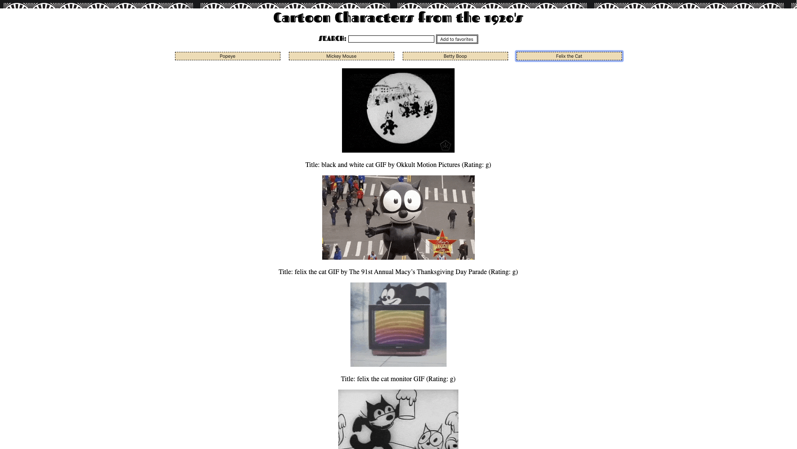

# jQueryAJAXgifs

An app to query gifs from giphy.com with an ajax method.
The app is designed wit a theme "Cartoon Characters from the 1920's" but any search will create a new button to allow new gifs from giphy to show up vertically on the screen.

Tools: HTML, CSS, jQuery, ajax, black and white cartoons!

To visit the site: https://etiennewarneck.github.io/jQueryAJAXgifs/

! 
